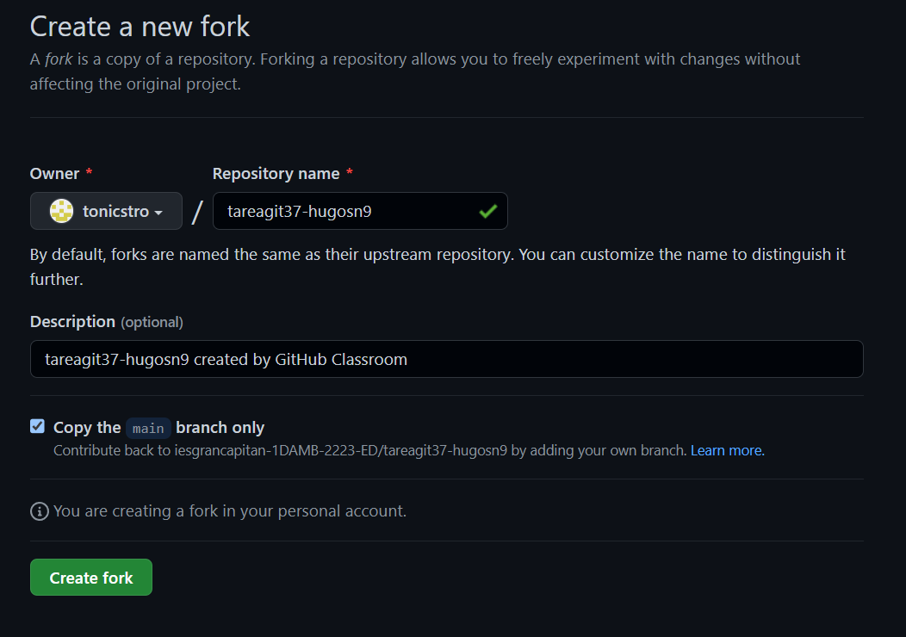

1.- Realizamos un fork del repositorio y creara una instancia del repositorio completo en tu cuenta


2.- Clonamos el repositorio localmente
```console
git clone <url del repositorio>


3.- Creamos una rama, la confirmamos y la guardamos
```console
git checkout -b "nombre de la rama"
git status
git add .
git commit -m "v1.0"
```


4.- Enviamos los cambios a github y luego de identificar el nombre lo enviamos en forma segura
```console
git remote
git push origin (nombre de la rama)


5.- Añadimos unos cambios para poder hacer posteriormente el pull request
```console
git add README.md
git commit -m "nombre"
git push origin (nombre)
```


6.- Creamos el pull request en el repositorio del compañero


7.- Sincronizamos la rama maestra con la del repositorio original
```console
git branch 
git checkout main
git remote add upstream (url del original)
git fetch upstream
git merge upstream/master
git push origin master 
git branch -d (nombre de la rama para borrar)
```


